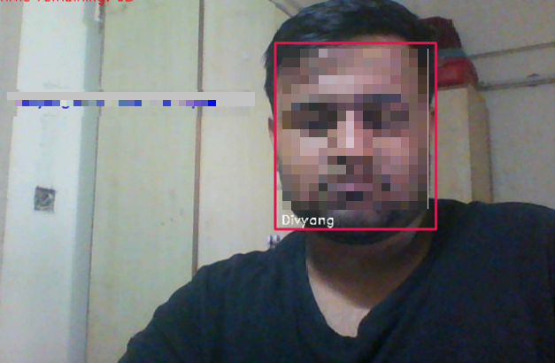

# Real Time Face Recognition System

A real time face recognition system using face_recognition library

 > A simple face recognitin library which uses dlib to encode face features and compare them

Dependencies
 - dlib
 - face recognition
 - opencv
 - scikit-learn
 - numpy

References
 - https://github.com/ageitgey/face_recognition
 - https://github.com/topics/pyimagesearch

Recognized Face          

  
--- 

Installing
  - run this command
    - pip install -r requirements.txt
  - note for windows you need install cmake first 

Running the code

  1. first collect face sample
    - python collect_faces.py --dataset face_dataset --name john doe 

  2. Then encode features/landmarks from face
    - python encode_faces.py --dataset face_dataset

  3. Then recognize your face 
    - python recognition.py

  That all folks you have recognized your face successfully 
